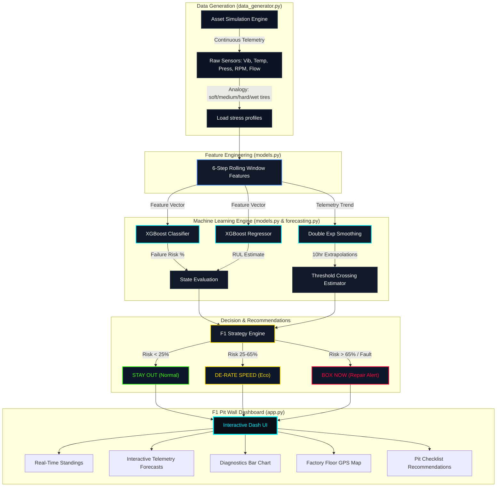

# ForgePredict AI 🏎️⚙️
> **Motorsport Telemetry Architecture for Industrial Predictive Maintenance**

ForgePredict AI is a premium, data-rich predictive maintenance dashboard inspired by Formula 1 strategy pit-wall telemetry. It monitors industrial equipment health, predicts failure probability using XGBoost, estimates Remaining Useful Life (RUL), and delivers maintenance strategy recommendations.

---

## 🌟 Key Features

*   **F1 Telemetry Dashboard**: Real-time telemetry dials showing active asset standings, load stress profiles (analogous to F1 tire compounds: Soft, Medium, Hard, Wet), and future sensor forecast trendlines.
*   **Explainable XGBoost Engine**: Transparent diagnostic panel showing XGBoost feature attribution weights to isolate exactly which sensor is causing machine warnings.
*   **Interactive Pit Strategy**: Actively test operating strategies like Eco speed caps, simulate maintenance box windows, and print strategy reports on the fly.
*   **Failure Replay Scrubber**: A timeline scrubber that lets operators freeze the dashboard and rewind telemetry logs up to 10 hours in the past to inspect degradation periods.
*   **AI Chat Assistant**: A rule-based conversational NLP bot connected directly to the active telemetry DataFrame to answer questions like *"Why is Asset-03 risky?"* or *"How many hours before failure?"*.
*   **AI Model Performance Lab**: A dedicated ML evaluation suite showing validation curves (Confusion Matrix heatmap, ROC Curve sensitivity, global SHAP feature importances) and training hyperparameters.
*   **Enterprise PDF Reporting**: Prints clean, formatted strategy reports directly from the browser by auto-hiding interactive buttons and panels using print-media styling.

---

## ⚙️ System Architecture

---

## 🛠️ Technology Stack

*   **Core**: Python
*   **Web Dashboard**: Plotly Dash, Dash Bootstrap Components
*   **Visualizations**: Plotly Graph Objects (SVG figures, heatmaps, scatter plots)
*   **Machine Learning**: XGBoost (Classifier & Regressor), Scikit-Learn
*   **Data Wrangling**: Pandas, NumPy
*   **Styling**: Custom CSS (glowing stats, radar-conic conics, typography overlays, responsive panels)

---

## 📂 Project Structure

*   `app.py`: Main dashboard code handling page routing, interactive callbacks, and custom tab views.
*   `models.py`: Trains the XGBoost classifier and regressor on startup.
*   `data_generator.py`: Simulates 4 assets under soft/medium/hard tyre stress profiles.
*   `forecasting.py`: Implements Double Exponential Smoothing for sensor trends.
*   `assets/custom.css`: Cyber-dark motorsport theme stylesheets.
*   `run_dashboard.bat`: Zero-config launcher script.

---

## 🚀 How to Run

### One-Click Setup (Windows)
Double-click the **`run_dashboard.bat`** file in the project folder. The script will automatically:
1. Set up a Python virtual environment (`.venv`) if not already present.
2. Install all dependencies from `requirements.txt` using the fast `uv` installer.
3. Start the dashboard server and retrain the XGBoost models.
4. Launch your browser at [http://127.0.0.1:8050/](http://127.0.0.1:8050/).

---

## ✍️ Author
**Kavyaa Jaiswal** - *AI Engineer*
*   [GitHub](https://github.com/kavyyyaaa)
*   [LinkedIn](https://linkedin.com)
